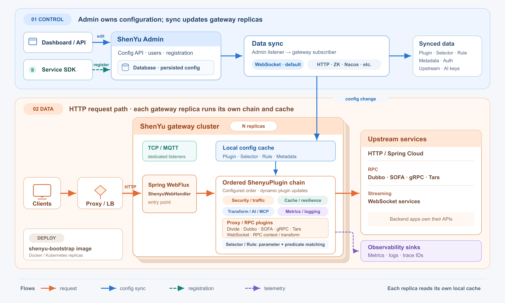

<p align="center">
  <picture>
    <source media="(prefers-color-scheme: dark)" srcset="https://raw.githubusercontent.com/apache/shenyu-website/main/static/img/logo-light.svg">
    <source media="(prefers-color-scheme: light)" srcset="https://raw.githubusercontent.com/apache/shenyu-website/main/static/img/logo.svg">
    
  </picture>
</p>

<p align="center">
  <a href="https://search.maven.org/search?q=g:org.apache.shenyu%20AND%20a:shenyu"></a>
  <a href="LICENSE"></a>
  <a href="https://github.com/apache/shenyu/actions/workflows/ci.yml"></a>
  <a href="https://codecov.io/gh/apache/shenyu"></a>
  <a href="https://hub.docker.com/r/apache/shenyu-bootstrap/tags"></a>
  <a href="https://gitpod.io/#https://github.com/apache/shenyu"></a>
  <a href="https://deepwiki.com/apache/shenyu"></a>
</p>

<p align="center">
  <a href="https://shenyu.apache.org/"></a>
  <a href="https://shenyu.apache.org/download/"></a>
</p>

<p align="center">
  <a href="https://trendshift.io/repositories/3415"></a>
</p>

## Overview

Apache ShenYu is a Java-based gateway for service proxying, protocol conversion, and API governance. An extensible plugin chain processes requests, while ShenYu Admin manages and distributes configuration to gateway replicas.

## Core Capabilities

| Area | What ShenYu provides |
| --- | --- |
| Plugin routing and extensions | An ordered plugin chain for HTTP requests, with selector and rule matching where applicable. Spring Boot starters select plugins; [custom Java plugins](https://shenyu.apache.org/docs/developer/custom-plugin/), SPI implementations, and WASM plugin APIs extend the gateway. |
| Protocols and upstreams | HTTP and Spring Cloud services, WebSocket connections, and Apache Dubbo, gRPC, SOFA, and Tars backends. Optional TCP and MQTT listeners provide additional ingress. |
| Registration and discovery | Client SDKs register service addresses and API metadata with Admin. Registry integrations support discovery; an optional Kubernetes controller reconciles Ingress and Endpoints resources. |
| Security and traffic control | WAF, signing, authentication plugins, load balancing, rate limiting, and fault tolerance through Hystrix, Resilience4j, and Sentinel. |
| Caching and transformation | In-memory or Redis-backed response caching, URL rewriting, redirection, and request/response transformation. |
| Dynamic configuration | Admin persists plugins, selectors, rules, metadata, and authentication data. WebSocket sync is the default; HTTP long polling, ZooKeeper, Nacos, etcd, Consul, Apollo, and Polaris are available. Gateway replicas apply updates to their local caches. |
| Observability | Metrics and logging plugins, including Kafka, Pulsar, Elasticsearch, and ClickHouse destinations; email and DingTalk alerts from Admin. |
| AI and MCP | AI proxy, prompt processing, token limits, sensitive-word filtering, AI request/response transformation, and an MCP server plugin with SSE and Streamable HTTP. |

## Architecture



## Get Started

Start with the [English documentation](https://shenyu.apache.org/docs/), [中文文档](https://shenyu.apache.org/zh/docs/), or the [official downloads](https://shenyu.apache.org/download/).

### Docker quick start

Use Docker and OpenSSL to start ShenYu Admin, a gateway, and an example HTTP service. Run the commands below in the same shell.

#### Start the services

```bash
docker network create shenyu

export SHENYU_JWT_SECRETKEY="$(openssl rand -hex 32)"
export SHENYU_SYNC_WEBSOCKET_TOKEN="$(openssl rand -hex 32)"
export SHENYU_LOCAL_KEY="$(openssl rand -hex 24)"
export SHENYU_LOCAL_SHA512KEY="$(printf %s "$SHENYU_LOCAL_KEY" | openssl dgst -sha512 -r | awk '{print $1}')"

docker run -d --name shenyu-admin --network shenyu -p 127.0.0.1:9095:9095 \
  -e SHENYU_JWT_SECRETKEY -e SHENYU_SYNC_WEBSOCKET_TOKEN \
  apache/shenyu-admin:latest

docker run -d --name shenyu-demo --network shenyu nginx:stable-alpine

docker run -d --name shenyu-bootstrap --network shenyu -p 127.0.0.1:9195:9195 \
  -e SHENYU_SYNC_WEBSOCKET_URLS=ws://shenyu-admin:9095/websocket \
  -e SHENYU_SYNC_WEBSOCKET_TOKEN \
  -e SHENYU_HEARTBEAT_SERVERLISTS=http://shenyu-admin:9095 \
  -e SHENYU_LOCAL_ENABLED=true -e SHENYU_LOCAL_SHA512KEY \
  apache/shenyu-bootstrap:latest
```

Admin listens on `http://localhost:9095`; the gateway listens on `http://localhost:9195`. Wait for both services to start, then check their health endpoints:

```bash
curl -fsS http://localhost:9095/actuator/health
curl -fsS http://localhost:9195/actuator/health
```

#### Configure a sample route

The following request configures the `divide` plugin on this gateway to forward `/index.html` to the example service:

```bash
curl -fsS http://localhost:9195/shenyu/plugin/selectorAndRules \
  -H 'Content-Type: application/json' \
  -H "localKey: ${SHENYU_LOCAL_KEY}" \
  -d '{
    "pluginName": "divide",
    "selectorHandler": "[{\"upstreamUrl\":\"shenyu-demo:80\",\"protocol\":\"http\",\"weight\":100}]",
    "conditionDataList": [
      {"paramType": "uri", "operator": "match", "paramValue": "/index.html"}
    ],
    "ruleDataList": [{
      "ruleHandler": "{\"loadBalance\":\"random\"}",
      "conditionDataList": [
        {"paramType": "uri", "operator": "match", "paramValue": "/index.html"}
      ]
    }]
  }'
```

This request updates only this gateway instance; it does not write the route to Admin. For centrally managed, durable routes, configure them in Admin with a persistent database instead of the default in-memory H2 database.

#### Verify the route

```bash
curl -i http://localhost:9195/index.html
```

The response should contain the NGINX welcome page served through ShenYu.

## Why Apache ShenYu?

ShenYu (神禹) is an honorific name for Xia Yu, an ancient Chinese ruler also known as Da Yu. He is remembered for crossing the Yellow River three times for the benefit of the people and successfully controlling its floods. Alongside Yao and Shun, he is regarded as one of ancient China's three greatest kings.

The name reflects three ideas:

* It promotes the traditional virtues of Chinese civilization.
* It echoes a gateway's central role in governing traffic.
* It expresses the community's commitment to being fair, just, open, and meritocratic, in tribute to ShenYu and in keeping with the Apache Way.

## Community and Support

* [Contribute to ShenYu](https://shenyu.apache.org/community/contributor-guide)
* [Join the development mailing list](mailto:dev@shenyu.apache.org)

## Known Users

The [Known Users page](https://shenyu.apache.org/community/user-registration) lists registered users in registration order.

Organizations using Apache ShenYu are welcome to [register through GitHub issue #68](https://github.com/apache/shenyu/issues/68). Registration is for open source users only.

## Star History

<a href="https://www.star-history.com/?repos=apache%2Fshenyu&amp;type=date">
  <picture>
    <source media="(prefers-color-scheme: dark)" srcset="https://api.star-history.com/chart?repos=apache/shenyu&amp;type=date&amp;theme=dark" />
    <source media="(prefers-color-scheme: light)" srcset="https://api.star-history.com/chart?repos=apache/shenyu&amp;type=date" />
    
  </picture>
</a>

## License

Apache ShenYu is licensed under the [Apache License, Version 2.0](LICENSE).
